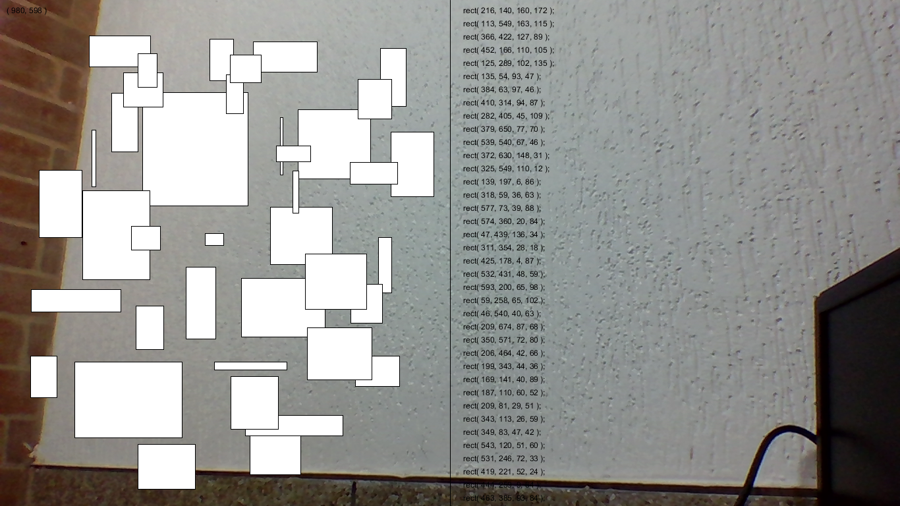

# ShapeCodeWriterCam (English)

ShapeCodeWriterCam is a prototype that combines the use of virtual reality glasses and Wiimote or Bluetooth gyroscope, allows the user to draw geometric shapes in the air, but, at the same time, generates the source code in Processing language. Developed by Jose David Cuartas in 2016 as a proof of concept. In other words, this development allows the user movement to be translated into the programming code required to draw the same shapes in another Processing sketch.

# ShapeCodeWriterCam (Español)

Es un prototipo que combina el uso de gafas de realidad virtual y de Wiimote o giroscopio Bluetooth, le permite al usuario dibujar formas geométricas de aire, pero, al mismo tiempo, genera el código fuente en lenguaje Processing. Desarrollado por Jose David Cuartas en el año 2016 como una prueba de concepto. En otras palabras este desarrollo permite
traducir el movimiento de usuario en el código de programación necesario para poder dibujar las mismas formas en otro sketch de Processing.

